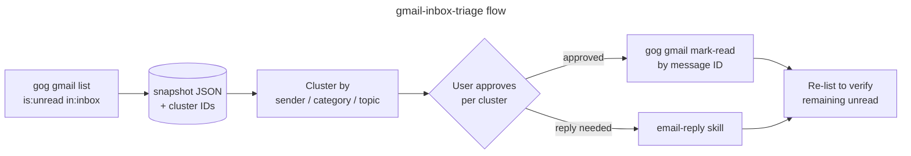

# gmail-handler

A [Claude Code](https://claude.com/claude-code) skill for triaging an unread Gmail inbox: cluster messages by sender/topic, recommend bulk actions, and mark them read after you approve — without losing track of mail that arrives mid-triage.

Powered by [`gog`](https://github.com/) (a Go-based Gmail/Google Workspace CLI). The skill drives `gog` from Claude Code; there's no Python runtime in the active path.

## What it does



The key design choice: mark-read targets **specific message IDs from the snapshot**, not a Gmail search query. So any new mail that arrives between the snapshot and your approval is left untouched.

## Installation

The skill lives under `skills/gmail-inbox-triage/`. To use it in Claude Code, place the directory under `~/.claude/skills/` (or symlink it). Then invoke with `/gmail-inbox-triage`.

### Prerequisites

- `gog` CLI installed and authenticated for your Gmail account:
  ```bash
  gog gmail list --max 1 -a you@example.com
  ```
- `jq` (used to stream message IDs to `xargs` for larger clusters).

## Usage

```
/gmail-inbox-triage                     # Show usage explainer
/gmail-inbox-triage triage my inbox     # Run the full flow
/gmail-inbox-triage just clear marketing junk
/gmail-inbox-triage help me get to inbox zero
```

Defaults: account `vbalasu@gmail.com`, window `newer_than:3m`. Override either by saying so.

## Repo layout

```
skills/gmail-inbox-triage/
├── SKILL.md                       # Skill spec (workflow, constraints)
├── references/gog-cheatsheet.md   # Quick reference for gog commands
└── scripts/triage.py              # Legacy checklist-driven script (not used by current flow)
```

`scripts/triage.py` is kept for backwards-compat with the original checklist-based design (it also shells out to `gog`). The active skill workflow does not invoke it. The `simplegmail` entry in `requirements.txt` is a leftover from an even earlier prototype and is no longer used by anything in this repo.
