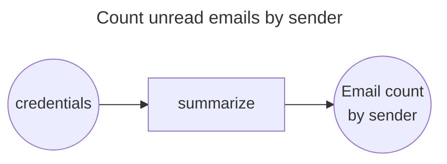
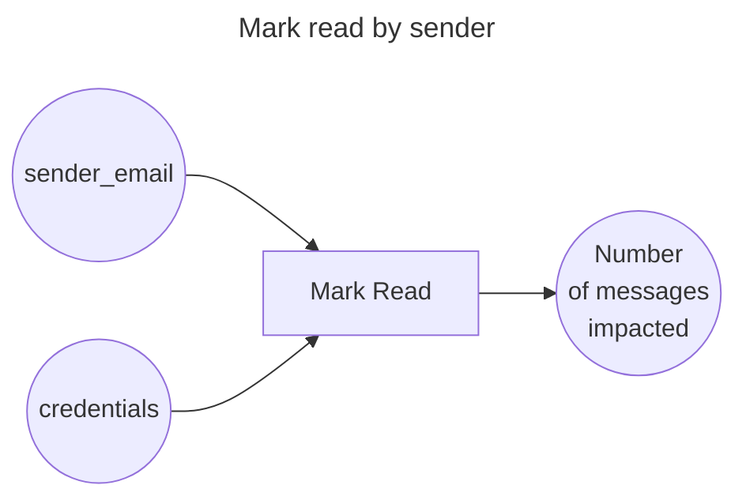
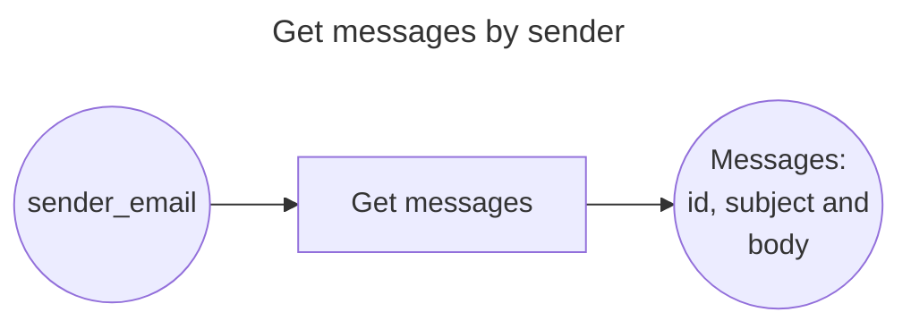

# gmail-handler

Powered by simplegmail

---

```mermaid
---
title: "Count unread emails by sender"
---
flowchart LR;
  credentials((credentials)) --> summarize  --> count((Email count \n by sender));
```

---

```mermaid
---
title: "Mark read by sender"
---
flowchart LR;
  sender((sender_email)) --> mark_read[Mark Read] --> response((Number \n of messages \nimpacted));
  credentials((credentials)) -->mark_read;
```

---

```mermaid
---
title: "Get messages by sender"
---
flowchart LR;
  sender((sender_email)) --> get_messages[Get messages] --> response((Messages: \nid, subject and\nbody))
```